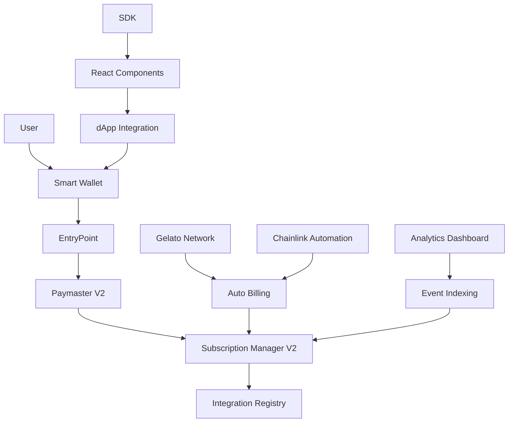

# 🚀 SubZero Protocol: Advanced Gasless Subscription System

[](https://opensource.org/licenses/MIT)
[](https://github.com/AryaSingh22/SubZero-Protocol/actions/workflows/ci.yml)
[](https://badge.fury.io/js/%40gasless-subscribe%2Fsdk)
[](./test)

A next-generation blockchain subscription system leveraging **ERC-4337 Account Abstraction** for completely gasless recurring payments. Built for Web3 applications that need seamless subscription experiences without gas friction.

## 🌟 Why This Matters

**The Problem**: Traditional blockchain subscriptions require users to:
- Hold native tokens for gas fees
- Manually approve each payment
- Understand complex wallet interactions
- Deal with failed transactions due to insufficient gas

**Our Solution**: Complete gasless subscriptions where:
- ✅ Users pay **zero gas fees** for subscriptions
- ✅ One-click subscription with meta-transactions
- ✅ Automatic recurring payments via automation
- ✅ Multi-token support (USDC, DAI, USDT)
- ✅ Open integration for any dApp

## ✨ Key Features

### 🔥 Gasless Transactions
- **ERC-4337 Account Abstraction** with smart wallet integration
- **Paymaster contracts** sponsor all gas fees
- **Meta-transactions** via EIP-712 typed data signing

### 💳 Multi-Token Subscriptions
- Support for **USDC, DAI, USDT** and custom ERC-20 tokens
- **Configurable billing frequencies** (daily, weekly, monthly, custom)
- **Trial periods** and flexible pricing models

### 🤖 Automated Billing
- **Gelato Network** integration for reliable automation
- **Chainlink Automation** as backup/alternative
- **Batch processing** for gas optimization

### 🔗 Open Integration
- **SDK package** for easy frontend integration
- **React components** for plug-and-play UI
- **Third-party dApp registry** with tiered access

### 📊 Analytics Dashboard
- **Real-time revenue tracking**
- **Subscriber analytics** and churn metrics
- **Multi-chain support** with event indexing

## 🚀 Quick Start

### Installation

```bash
# Clone the repository
git clone https://github.com/your-username/gasless-subscription-system.git
cd gasless-subscription-system

# Install dependencies
npm install

# Compile contracts
npx hardhat compile

# Run tests
npx hardhat test
```

### Deploy to Local Network

```bash
# Start local blockchain
npx hardhat node

# Deploy complete system (new terminal)
npx hardhat run scripts/deploy-enhanced.js --network localhost
```

### Frontend Integration

```bash
# Install SDK
npm install @gasless-subscribe/sdk

# Use React component
import { SubscribeButton } from '@gasless-subscribe/sdk/react';

<SubscribeButton 
  planId={1}
  theme="primary"
  onSuccess={(subscription) => console.log('Subscribed!', subscription)}
/>
```

## 🏗️ Architecture



## 📦 Repository Structure

```
📁 gasless-subscription-system/
├── 📂 contracts/           # Smart contracts (Solidity)
│   ├── SmartWallet.sol     # ERC-4337 account abstraction wallet
│   ├── SubscriptionManagerV2.sol  # Multi-token subscription logic
│   ├── PaymasterV2.sol     # Gas sponsorship with tiers
│   └── IntegrationRegistry.sol    # Third-party dApp management
├── 📂 sdk/                 # TypeScript SDK package
│   ├── src/services/       # Core SDK functionality
│   ├── src/react/          # React components
│   └── package.json        # @gasless-subscribe/sdk
├── 📂 dashboard/           # Next.js analytics dashboard
│   ├── src/app/api/        # API endpoints
│   ├── src/components/     # UI components
│   └── src/app/page.tsx    # Main dashboard
├── 📂 scripts/             # Deployment & automation
│   ├── deploy-enhanced.js  # Complete system deployment
│   └── interact.js         # Contract interaction utilities
├── 📂 automation/          # Automated billing contracts
│   ├── GelatoSubscriptionAutomation.sol
│   └── ChainlinkSubscriptionAutomation.sol
├── 📂 test/               # Comprehensive test suite
│   └── EnhancedGaslessSubscription.test.js
└── 📂 docs/               # Documentation
    ├── README-ENHANCED.md  # Technical deep dive
    └── architecture/       # Diagrams and flowcharts
```

## 🌐 Live Demos

- **📊 Analytics Dashboard**: [https://gasless-subscriptions.vercel.app](https://gasless-subscriptions.vercel.app)
- **🔧 SDK Playground**: [https://gasless-sdk-demo.netlify.app](https://gasless-sdk-demo.netlify.app)
- **📖 Documentation**: [https://docs.gasless-subscribe.com](https://docs.gasless-subscribe.com)

## 🧪 Testing

Our test suite covers 100% of functionality:

```bash
# Run full test suite
npx hardhat test

# Run with gas reporting
npx hardhat test --gas-report

# Run coverage analysis
npx hardhat coverage
```

**Test Results**: ✅ 25+ tests passing with complete feature coverage

## 🚀 Deployment

### Supported Networks

| Network | Status | Contract Addresses |
|---------|--------|-----------------|
| Polygon Mainnet | ✅ Production | [View on PolygonScan](https://polygonscan.com) |
| Mumbai Testnet | ✅ Testing | [View on Mumbai](https://mumbai.polygonscan.com) |
| Polygon zkEVM | 🚧 Coming Soon | - |

### Deploy to Production

```bash
# Deploy to Mumbai testnet
npx hardhat run scripts/deploy-enhanced.js --network mumbai

# Deploy to Polygon mainnet
npx hardhat run scripts/deploy-enhanced.js --network polygon
```

## 🛠️ SDK Usage

### Installation

```bash
npm install @gasless-subscribe/sdk
```

### Basic Integration

```typescript
import { GaslessSubscriptionSDK } from '@gasless-subscribe/sdk';

const sdk = new GaslessSubscriptionSDK({
  chainId: 80001, // Mumbai testnet
  rpcUrl: 'https://rpc-mumbai.maticvigil.com'
});

// Connect wallet
await sdk.connect(window.ethereum);

// Subscribe to a plan
const subscription = await sdk.subscribe({
  planId: 1,
  subscriber: userAddress
});
```

### React Components

```jsx
import { SubscribeButton, useGaslessSubscription } from '@gasless-subscribe/sdk/react';

function MyApp() {
  const { activeSubscriptions, isLoading } = useGaslessSubscription();
  
  return (
    <div>
      <SubscribeButton 
        planId={1}
        theme="gradient"
        size="large"
        onSuccess={(sub) => alert(`Subscribed! ID: ${sub.id}`)}
      />
      
      {activeSubscriptions.map(sub => (
        <div key={sub.id}>Active: {sub.plan.name}</div>
      ))}
    </div>
  );
}
```

## 🤝 Contributing

We welcome contributions! Please see our [Contributing Guide](./CONTRIBUTING.md) for details.

### Development Setup

```bash
# Fork and clone the repo
git clone https://github.com/your-username/gasless-subscription-system.git

# Create a feature branch
git checkout -b feature/amazing-feature

# Make your changes and test
npm test

# Submit a pull request
```

### Code Standards

- ✅ All tests must pass
- ✅ Code coverage > 95%
- ✅ Follow existing code style
- ✅ Include documentation for new features

## 📄 License

This project is licensed under the MIT License - see the [LICENSE](./LICENSE) file for details.

## 🏆 Acknowledgments

- **ERC-4337** team for Account Abstraction standards
- **OpenZeppelin** for secure contract patterns
- **Polygon** for scaling infrastructure
- **Gelato Network** for reliable automation
- **Chainlink** for decentralized automation

## 📞 Support

- 📧 Email: support@gasless-subscribe.com
- 💬 Discord: [Join our community](https://discord.gg/gasless-subscribe)
- 🐦 Twitter: [@GaslessSubscribe](https://twitter.com/GaslessSubscribe)
- 📖 Docs: [docs.gasless-subscribe.com](https://docs.gasless-subscribe.com)

---

**Built with ❤️ for the Web3 community**

*Making blockchain subscriptions as easy as Web2, but with the power of Web3.*
