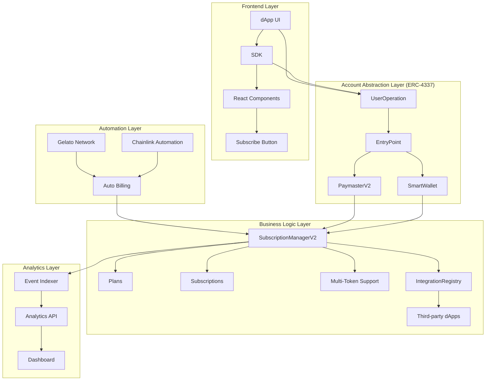
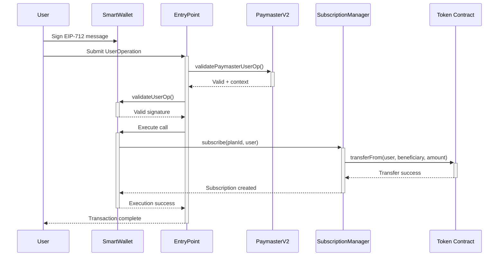
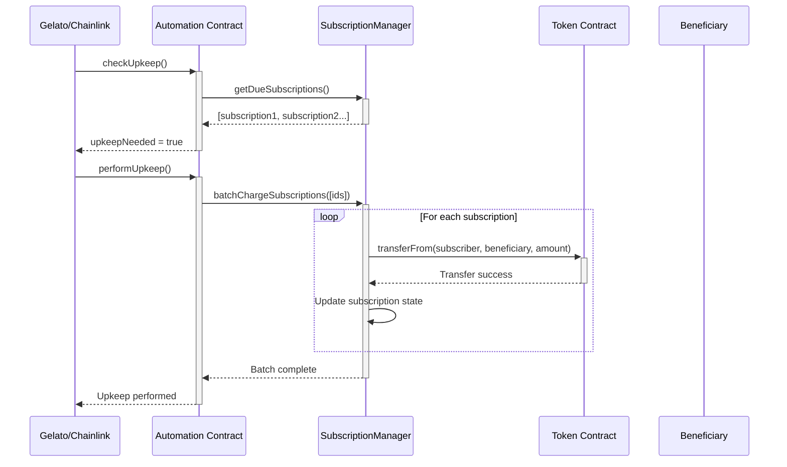
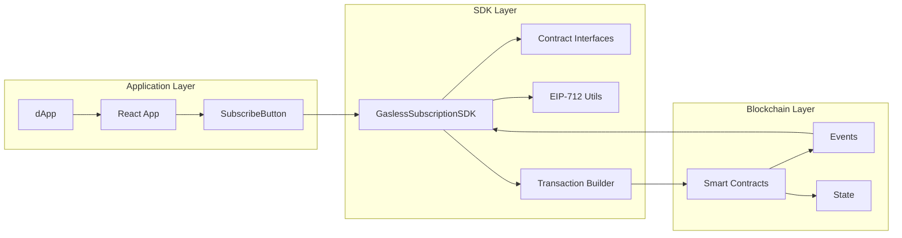
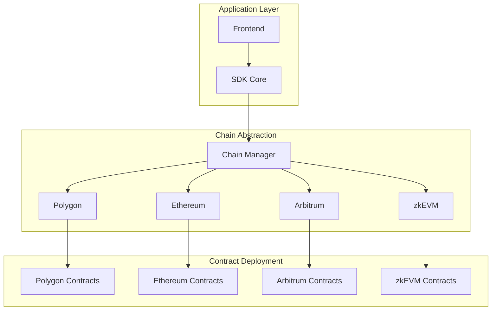
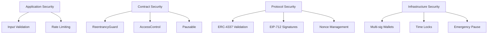
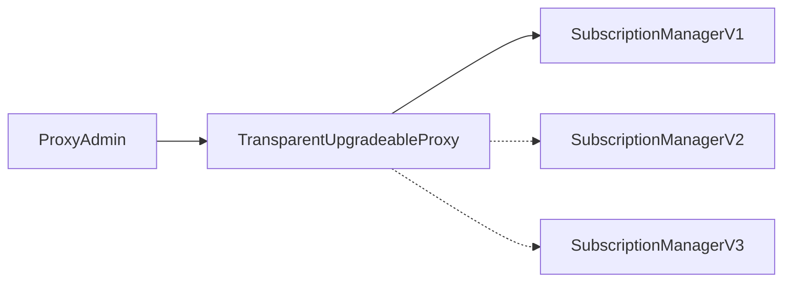
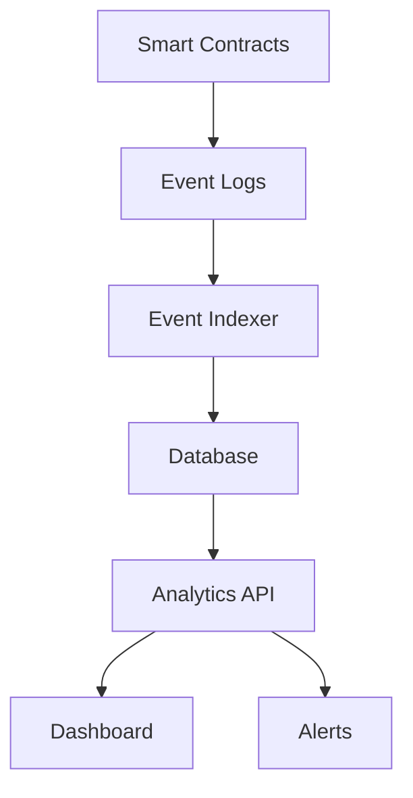

# System Architecture

## 🏗️ High-Level Architecture

## 🔄 Transaction Flow

### Gasless Subscription Flow

### Automated Billing Flow

## 📊 Component Interactions

### SDK Integration

### Multi-Chain Architecture

## 🔐 Security Model

### Access Control Matrix

| Role | SmartWallet | SubscriptionManager | PaymasterV2 | IntegrationRegistry |
|------|-------------|-------------------|-------------|-------------------|
| Owner | Full Control | Create Plans | Gas Limits | Register dApps |
| User | Execute Txns | Subscribe/Cancel | - | - |
| Relayer | Submit UserOps | Automated Billing | Whitelisted | - |
| Paymaster | - | - | Sponsor Gas | - |

### Security Layers

## 📈 Scalability Considerations

### Gas Optimization Strategies

1. **Batch Operations**
   - Process multiple subscriptions in one transaction
   - Reduce per-transaction overhead
   - Optimize for high-volume scenarios

2. **Efficient Storage**
   - Pack structs to minimize storage slots
   - Use events for historical data
   - Minimize state changes

3. **Layer 2 Integration**
   - Deploy on Polygon for low costs
   - Support multiple L2 solutions
   - Cross-chain subscription management

### Performance Metrics

| Operation | Gas Cost | Batch Size | Optimization |
|-----------|----------|------------|--------------|
| Single Subscribe | ~200k | 1 | Baseline |
| Batch Subscribe | ~150k | 10 | 25% savings |
| Single Charge | ~80k | 1 | Baseline |
| Batch Charge | ~60k | 25 | 25% savings |

## 🔄 Upgrade Patterns

### Proxy Architecture

### Migration Strategy

1. **Deploy New Implementation**
2. **Test on Testnet**
3. **Gradual Migration**
4. **Full Cutover**

## 📊 Monitoring & Analytics

### Event Architecture

### Key Metrics

- **Subscription Metrics**: Active subs, churn rate, LTV
- **Financial Metrics**: MRR, revenue per user, payment success rate
- **Technical Metrics**: Gas usage, transaction success rate, automation uptime
- **User Metrics**: Adoption rate, user engagement, support tickets

This architecture enables a scalable, secure, and user-friendly gasless subscription system built on modern Web3 infrastructure.