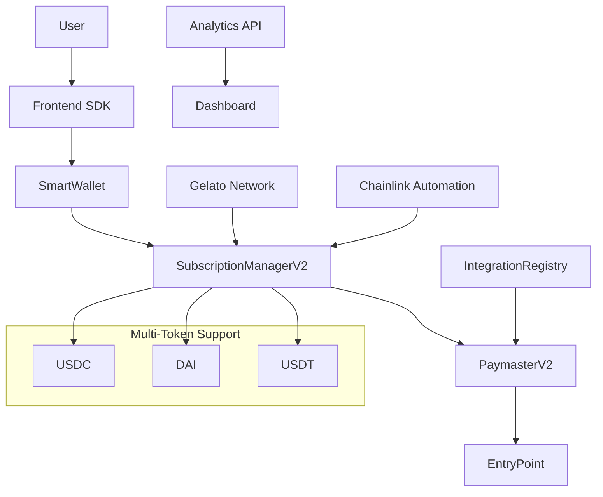

# Enhanced Gasless Subscription System - Complete Guide

A comprehensive ERC-4337 account abstraction-based subscription payment system with multi-token support, automated billing, and open integration capabilities.

## 🌟 Overview

The Enhanced Gasless Subscription System revolutionizes recurring payments on blockchain by providing:

- **Gasless Transactions**: Users never pay gas fees for subscription operations
- **Multi-Token Support**: Accept payments in USDC, DAI, USDT, and other ERC-20 tokens
- **Automated Billing**: Chainlink Automation and Gelato Network integration
- **Open Integration**: Third-party dApps can easily integrate gasless features
- **Analytics Dashboard**: Real-time subscription metrics and revenue tracking
- **Developer-Friendly SDK**: TypeScript SDK with React components

## 📋 Table of Contents

1. [Architecture](#architecture)
2. [Quick Start](#quick-start)
3. [SDK Integration](#sdk-integration)
4. [React Components](#react-components)
5. [Smart Contracts](#smart-contracts)
6. [Automation Setup](#automation-setup)
7. [Analytics Dashboard](#analytics-dashboard)
8. [Third-Party Integration](#third-party-integration)
9. [Deployment Guide](#deployment-guide)
10. [API Reference](#api-reference)
11. [Security Considerations](#security-considerations)
12. [Troubleshooting](#troubleshooting)

## 🏗️ Architecture

### Core Components



### Contract Hierarchy

- **SubscriptionManagerV2**: Core subscription logic with multi-token support
- **PaymasterV2**: Gas sponsorship with open integration mode
- **IntegrationRegistry**: Third-party dApp registration and management
- **SmartWallet**: ERC-4337 compliant account abstraction wallet
- **Automation Contracts**: Gelato and Chainlink integration for automated billing

## 🚀 Quick Start

### 1. Installation

```bash
# Clone the repository
git clone <your-repo-url>
cd gasless-subscription-system

# Install dependencies
npm install

# Install SDK
npm install @gasless-subscribe/sdk

# Install analytics dashboard dependencies
cd analytics-dashboard && npm install
```

### 2. Deploy Contracts

```bash
# Compile contracts
npx hardhat compile

# Deploy to Mumbai testnet
npx hardhat run scripts/deploy-enhanced.js --network mumbai

# Deploy automation contracts
npx hardhat run automation/deploy-automation.js --network mumbai
```

### 3. Basic Usage

```typescript
import { GaslessSubscriptionSDK, createGaslessSubscriptionSDK } from '@gasless-subscribe/sdk';
import { ethers } from 'ethers';

// Initialize SDK
const provider = new ethers.JsonRpcProvider('https://rpc-mumbai.maticvigil.com');
const signer = new ethers.Wallet(privateKey, provider);

const sdk = createGaslessSubscriptionSDK({
  provider,
  signer,
  config: {
    subscriptionManager: "0x...",
    paymaster: "0x...",
    smartWalletFactory: "0x...",
    entryPoint: "0x5FF137D4b0FDCD49DcA30c7CF57E578a026d2789",
    chainId: 80001,
    rpcUrl: "https://rpc-mumbai.maticvigil.com"
  }
});

// Connect wallet
await sdk.connect(signer);

// Subscribe to a plan
const result = await sdk.subscribe({
  planId: "1",
  trialPeriod: 604800 // 7 days
});

console.log("Subscription created:", result.hash);
```

## 💻 SDK Integration

### TypeScript SDK

#### Installation

```bash
npm install @gasless-subscribe/sdk ethers
```

#### Basic Setup

```typescript
import { 
  GaslessSubscriptionSDK, 
  DEFAULT_CONFIGS, 
  SUPPORTED_NETWORKS 
} from '@gasless-subscribe/sdk';

const config = {
  ...DEFAULT_CONFIGS[SUPPORTED_NETWORKS.POLYGON_MUMBAI],
  subscriptionManager: "YOUR_CONTRACT_ADDRESS",
  paymaster: "YOUR_PAYMASTER_ADDRESS",
  smartWalletFactory: "YOUR_FACTORY_ADDRESS"
};

const sdk = new GaslessSubscriptionSDK({
  provider: window.ethereum,
  config,
  debug: true // Enable debugging in development
});
```

#### Core Methods

```typescript
// Connect wallet
const status = await sdk.connect(signer);

// Create subscription
const subscription = await sdk.subscribe({
  planId: "1",
  customAmount: "29.99", // Override plan amount
  trialPeriod: 604800,   // 7 days trial
  metadata: {
    referralCode: "FRIEND2023"
  }
});

// Get user subscriptions
const subscriptions = await sdk.getActiveSubscriptions();

// Cancel subscription
await sdk.unsubscribe({
  subscriptionId: "123",
  immediate: true
});

// Get analytics
const analytics = await sdk.getAnalytics();
```

#### Error Handling

```typescript
import { SDKError, WalletError, TransactionError } from '@gasless-subscribe/sdk';

try {
  await sdk.subscribe({ planId: "1" });
} catch (error) {
  if (error instanceof WalletError) {
    console.error("Wallet connection issue:", error.message);
  } else if (error instanceof TransactionError) {
    console.error("Transaction failed:", error.details);
  } else if (error instanceof SDKError) {
    console.error("SDK error:", error.code, error.message);
  }
}
```

### Advanced Configuration

```typescript
const advancedConfig = {
  provider: ethersProvider,
  signer: ethersSigner,
  config: {
    subscriptionManager: "0x...",
    paymaster: "0x...",
    smartWalletFactory: "0x...",
    entryPoint: "0x5FF137D4b0FDCD49DcA30c7CF57E578a026d2789",
    chainId: 80001,
    rpcUrl: "https://rpc-mumbai.maticvigil.com",
    bundlerUrl: "https://bundler.biconomy.io/api/v2/80001" // Optional
  },
  debug: process.env.NODE_ENV === 'development'
};

const sdk = new GaslessSubscriptionSDK(advancedConfig);

// Enable automatic smart wallet deployment
sdk.deploySmartWallet();
```

## ⚛️ React Components

### Subscribe Button Component

```tsx
import React from 'react';
import { SubscribeButton, useGaslessSubscription } from '@gasless-subscribe/sdk/react';

function MyApp() {
  const sdk = useGaslessSubscription(mySDKInstance);

  return (
    <SubscribeButton
      planId="1"
      sdk={sdk}
      
      // Customization
      theme="dark"
      size="large"
      variant="primary"
      
      // Text customization
      subscribeText="Start Subscription"
      subscribingText="Processing..."
      subscribedText="Active ✓"
      
      // Plan overrides
      customAmount="19.99"
      trialPeriod={1209600} // 14 days
      
      // Event handlers
      onSubscribeSuccess={(result) => {
        console.log("Subscription successful!", result);
        // Track analytics, show success message, etc.
      }}
      onSubscribeError={(error) => {
        console.error("Subscription failed:", error);
        // Handle error, show error message
      }}
      
      // UI options
      showPlanDetails={true}
      showPrice={true}
      className="my-custom-class"
      style={{ marginTop: '20px' }}
    />
  );
}
```

### Custom Hook Usage

```tsx
import { useGaslessSubscription } from '@gasless-subscribe/sdk/react';

function SubscriptionManager({ sdk }) {
  const {
    isConnected,
    walletAddress,
    smartWalletAddress,
    isSmartWalletDeployed,
    subscribe,
    unsubscribe,
    getActiveSubscriptions,
    getPlan
  } = useGaslessSubscription(sdk);

  const [subscriptions, setSubscriptions] = useState([]);

  useEffect(() => {
    if (isConnected) {
      loadSubscriptions();
    }
  }, [isConnected]);

  const loadSubscriptions = async () => {
    const subs = await getActiveSubscriptions();
    setSubscriptions(subs);
  };

  return (
    <div>
      {isConnected ? (
        <div>
          <p>Wallet: {walletAddress}</p>
          <p>Smart Wallet: {smartWalletAddress}</p>
          <p>Deployed: {isSmartWalletDeployed ? 'Yes' : 'No'}</p>
          
          <h3>Active Subscriptions</h3>
          {subscriptions.map(sub => (
            <div key={sub.id}>
              <p>Plan: {sub.planId}</p>
              <p>Next Payment: {new Date(sub.nextPaymentTime * 1000).toLocaleDateString()}</p>
              <button onClick={() => unsubscribe(sub.id)}>
                Cancel
              </button>
            </div>
          ))}
        </div>
      ) : (
        <p>Please connect your wallet</p>
      )}
    </div>
  );
}
```

## 📊 Smart Contracts

### SubscriptionManagerV2

Enhanced subscription manager with multi-token support and configurable billing frequencies.

#### Key Features

- **Multi-Token Support**: Accept payments in any ERC-20 token
- **Flexible Billing**: Daily, weekly, monthly, quarterly, yearly, or custom intervals
- **Trial Periods**: Optional trial periods for new subscriptions
- **Analytics**: Built-in analytics and metrics tracking
- **Batch Operations**: Efficient batch processing for multiple subscriptions

#### Usage Examples

```solidity
// Create a monthly plan with USDC
subscriptionManager.createPlan(
    "Premium Plan",
    "Monthly premium subscription",
    10 * 10**6, // 10 USDC (6 decimals)
    usdcAddress,
    BillingFrequency.Monthly,
    0, // No custom interval
    0, // Unlimited payments
    604800 // 7-day trial
);

// Subscribe to a plan
subscriptionManager.subscribe(planId, subscriber);

// Charge a subscriber (called by automation)
subscriptionManager.chargeSubscriber(subscriptionId);
```

### PaymasterV2

Enhanced paymaster with open integration support and tiered access control.

#### Integration Tiers

- **Basic (Tier 0)**: 100K gas per transaction, 1M daily, 30M monthly
- **Pro (Tier 1)**: 300K gas per transaction, 5M daily, 150M monthly (requires staking)
- **Enterprise (Tier 2)**: 500K gas per transaction, 20M daily, 600M monthly (requires higher staking)

#### Usage Examples

```solidity
// Whitelist a target contract
paymaster.whitelistTarget(
    targetContract,
    1, // Pro tier
    gasAllowance,
    false, // No custom validation
    address(0)
);

// Stake for enhanced tier
paymaster.stakeForIntegration{value: 1 ether}(targetContract);
```

### IntegrationRegistry

Registry for third-party dApp integration with the gasless system.

#### Registration Process

```solidity
// 1. Register integration
integrationRegistry.registerIntegration{value: 0.1 ether}(
    contractAddress,
    "My dApp",
    "Description of my dApp",
    "https://mydapp.com",
    "https://mydapp.com/logo.png",
    [keccak256("defi"), keccak256("nft")], // Categories
    ["ethereum", "polygon"],
    false // No KYC required
);

// 2. Wait for approval (7-day timelock)

// 3. Integration is approved by admin
integrationRegistry.approveIntegration(
    contractAddress,
    gasAllowance,
    dailyLimit,
    monthlyLimit
);
```

## 🤖 Automation Setup

### Gelato Network Integration

1. **Deploy GelatoSubscriptionAutomation contract**
2. **Visit [Gelato App](https://app.gelato.network/)**
3. **Create new task**:
   - Target contract: Your GelatoSubscriptionAutomation address
   - Function: `checker()`
   - Execution function: Will be determined by checker
4. **Fund your Gelato balance** with ETH for gas costs

### Chainlink Automation Integration

1. **Deploy ChainlinkSubscriptionAutomation contract**
2. **Visit [Chainlink Automation](https://automation.chain.link/)**
3. **Register new upkeep**:
   - Target contract: Your ChainlinkSubscriptionAutomation address
   - Gas limit: 2,000,000
   - Check data: `0x` (empty)
4. **Fund upkeep** with LINK tokens

### Configuration Example

```javascript
// Configure automation parameters
await gelatoAutomation.updateConfig(
  50,   // Max 50 subscriptions per batch
  3600  // Execute every hour
);

await chainlinkAutomation.updateConfig(
  25,   // Max 25 subscriptions per batch
  1800  // Execute every 30 minutes
);

// Set authorized executors
await gelatoAutomation.setAuthorizedExecutor(adminAddress, true);
await chainlinkAutomation.setAuthorizedKeeper(adminAddress, true);
```

## 📈 Analytics Dashboard

### Setup

```bash
cd analytics-dashboard
npm install
npm run dev
```

### Configuration

Create `.env.local`:

```env
NEXT_PUBLIC_SUBSCRIPTION_MANAGER_POLYGON=0x...
NEXT_PUBLIC_SUBSCRIPTION_MANAGER_MUMBAI=0x...
POLYGON_RPC_URL=https://polygon-rpc.com/
MUMBAI_RPC_URL=https://rpc-mumbai.maticvigil.com/
```

### API Usage

```typescript
// Fetch analytics data
const response = await fetch('/api/analytics?' + new URLSearchParams({
  chainId: '80001',
  timeRange: 'month',
  creator: '0x...' // Optional filter by creator
}));

const analytics = await response.json();
console.log(analytics);
```

### Custom Analytics Integration

```typescript
import { AnalyticsData } from '@gasless-subscribe/sdk';

class CustomAnalytics {
  async getSubscriptionMetrics(planId: string): Promise<AnalyticsData> {
    const response = await fetch(`/api/analytics?planId=${planId}`);
    return response.json();
  }

  async trackConversion(planId: string, userId: string) {
    // Custom conversion tracking
    analytics.track('subscription_conversion', {
      plan_id: planId,
      user_id: userId,
      timestamp: Date.now()
    });
  }
}
```

## 🔌 Third-Party Integration

### For dApp Developers

#### 1. Register Your Integration

```typescript
import { IntegrationRegistry } from '@gasless-subscribe/contracts';

const registry = new ethers.Contract(registryAddress, IntegrationRegistry.abi, signer);

await registry.registerIntegration(
  myContractAddress,
  "My DeFi Protocol",
  "Gasless DeFi operations for users",
  "https://myprotocol.com",
  "https://myprotocol.com/logo.png",
  [ethers.keccak256(ethers.toUtf8Bytes("defi"))],
  ["ethereum", "polygon"],
  false,
  { value: ethers.parseEther("0.1") } // Registration fee
);
```

#### 2. Implement Gasless Functions

```solidity
contract MyDeFiProtocol {
    ISubscriptionManager public subscriptionManager;
    
    modifier gasless() {
        require(
            msg.sender == address(subscriptionManager) || 
            msg.sender == owner(),
            "Not authorized"
        );
        _;
    }
    
    function gaslessStake(address user, uint256 amount) external gasless {
        // Implement staking logic
        _stake(user, amount);
    }
    
    function gaslessUnstake(address user, uint256 amount) external gasless {
        // Implement unstaking logic  
        _unstake(user, amount);
    }
}
```

#### 3. Use the SDK in Your Frontend

```typescript
import { GaslessSubscriptionSDK } from '@gasless-subscribe/sdk';

// Initialize SDK with your integration
const sdk = new GaslessSubscriptionSDK({
  provider,
  signer,
  config: {
    subscriptionManager: SUBSCRIPTION_MANAGER_ADDRESS,
    paymaster: PAYMASTER_ADDRESS,
    // ... other config
  }
});

// Create gasless transaction for your protocol
const callData = myProtocol.interface.encodeFunctionData("gaslessStake", [
  userAddress,
  stakeAmount
]);

const userOp = await sdk.createUserOperation(
  myProtocolAddress,
  "0", // No ETH value
  callData
);

const result = await sdk.submitUserOperation(userOp);
```

### Integration Checklist

- [ ] Contract implements gasless functions with proper access control
- [ ] Integration registered in IntegrationRegistry
- [ ] Integration approved by system admin
- [ ] PaymasterV2 has whitelisted your contract
- [ ] Frontend integrates gasless SDK
- [ ] Gas usage monitored and optimized
- [ ] User experience tested end-to-end

## 🚀 Deployment Guide

### Prerequisites

1. **Node.js** v16 or higher
2. **Hardhat** development environment
3. **Network RPC URLs** for target networks
4. **Private keys** for deployment accounts
5. **Sufficient ETH** for gas costs

### Environment Setup

Create `.env` file:

```env
# Network RPCs
POLYGON_RPC_URL=https://polygon-rpc.com/
MUMBAI_RPC_URL=https://rpc-mumbai.maticvigil.com/
POLYGON_ZKEVM_RPC_URL=https://rpc.public.zkevm-test.net

# Deployment keys
PRIVATE_KEY=your_private_key_here

# API keys for verification
POLYGONSCAN_API_KEY=your_polygonscan_api_key
ETHERSCAN_API_KEY=your_etherscan_api_key

# Contract addresses (after deployment)
SUBSCRIPTION_MANAGER_ADDRESS=
PAYMASTER_ADDRESS=
INTEGRATION_REGISTRY_ADDRESS=
```

### Step-by-Step Deployment

#### 1. Compile Contracts

```bash
npx hardhat compile
```

#### 2. Deploy Core System

```bash
# Deploy to Mumbai testnet
npx hardhat run scripts/deploy-enhanced.js --network mumbai

# Deploy to Polygon mainnet
npx hardhat run scripts/deploy-enhanced.js --network polygon
```

#### 3. Deploy Automation

```bash
# Deploy automation contracts
npx hardhat run automation/deploy-automation.js --network mumbai
```

#### 4. Verify Contracts

```bash
# Verify all contracts (commands provided by deployment script)
npx hardhat verify --network mumbai 0x... "constructor_arg1" "constructor_arg2"
```

#### 5. Configure System

```bash
# Fund paymaster
npx hardhat run scripts/fund-paymaster.js --network mumbai

# Setup automation
npx hardhat run scripts/setup-automation.js --network mumbai
```

### Production Deployment Considerations

1. **Security Audit**: Get contracts audited by professionals
2. **Gradual Rollout**: Start with limited functionality and scale up
3. **Monitoring**: Set up monitoring and alerting for all components
4. **Backup Plans**: Have emergency pause and recovery mechanisms
5. **Insurance**: Consider smart contract insurance for large deployments

## 📚 API Reference

### SDK Methods

#### Core Methods

```typescript
class GaslessSubscriptionSDK {
  // Wallet connection
  async connect(signer: ethers.Signer): Promise<WalletConnectionStatus>
  
  // Subscription operations
  async subscribe(options: SubscribeOptions): Promise<TransactionResult>
  async unsubscribe(options: UnsubscribeOptions): Promise<TransactionResult>
  
  // Data retrieval
  async getActiveSubscriptions(userAddress?: string): Promise<Subscription[]>
  async getPlan(planId: string): Promise<SubscriptionPlan | null>
  async getSubscription(subscriptionId: string): Promise<Subscription | null>
  async getAnalytics(creatorAddress?: string): Promise<AnalyticsData>
  
  // Smart wallet management
  async deploySmartWallet(): Promise<TransactionResult>
  
  // Getters
  get isConnected(): boolean
  get connectedAddress(): string | undefined
  get smartWalletAddr(): string | undefined
  get isSmartWalletDeployed(): boolean
}
```

#### Utility Functions

```typescript
// Address calculation
function calculateSmartWalletAddress(
  factory: string,
  owner: string,
  salt?: string | number
): string

// EIP-712 signing
async function signUserOperation(
  userOp: Omit<UserOperation, 'signature'>,
  signer: ethers.Signer,
  chainId: number,
  verifyingContract: string
): Promise<string>

// Token formatting
function formatTokenAmount(
  amount: string,
  decimals?: number,
  precision?: number
): string

function parseTokenAmount(amount: string, decimals?: number): string

// Validation
function isValidAddress(address: string): boolean
function validatePlanParameters(plan: PlanParams): ValidationResult
```

### Contract Interfaces

#### SubscriptionManagerV2

```solidity
interface ISubscriptionManagerV2 {
    function createPlan(
        string memory name,
        string memory description,
        uint256 amount,
        address tokenAddress,
        BillingFrequency billingFrequency,
        uint256 customInterval,
        uint256 maxPayments,
        uint256 trialPeriod
    ) external returns (uint256 planId);

    function subscribe(uint256 planId, address subscriber) external returns (uint256 subscriptionId);
    function unsubscribe(uint256 subscriptionId) external;
    function chargeSubscriber(uint256 subscriptionId) external returns (bool success);
    
    function getPlan(uint256 planId) external view returns (Plan memory);
    function getSubscription(uint256 subscriptionId) external view returns (Subscription memory);
    function getUserSubscriptions(address user) external view returns (uint256[] memory);
    function getPlanAnalytics(uint256 planId) external view returns (PlanAnalytics memory);
}
```

#### PaymasterV2

```solidity
interface IPaymasterV2 {
    function whitelistTarget(
        address target,
        uint256 tierId,
        uint256 gasAllowance,
        bool requiresValidation,
        address validator
    ) external;
    
    function stakeForIntegration(address integration) external payable;
    function unstakeFromIntegration(address integration, uint256 amount) external;
    
    function getIntegrationUsage(address integration) external view returns (IntegrationUsage memory);
    function getIntegrationTier(uint256 tierId) external view returns (IntegrationTier memory);
    function isTargetWhitelisted(address target) external view returns (bool);
}
```

### REST API Endpoints

#### Analytics API

```typescript
GET /api/analytics
Query Parameters:
- chainId: number (required) - Network chain ID
- timeRange: 'day' | 'week' | 'month' | 'year' (optional)
- creator: string (optional) - Filter by plan creator address
- planId: string (optional) - Filter by specific plan
- startDate: string (optional) - Start date for custom range
- endDate: string (optional) - End date for custom range

Response: AnalyticsData
```

## 🔒 Security Considerations

### Smart Contract Security

1. **Access Control**: All critical functions have proper access control modifiers
2. **Reentrancy Protection**: ReentrancyGuard used where needed
3. **Safe Math**: Using OpenZeppelin's SafeMath and SafeERC20
4. **Pause Mechanism**: Emergency pause functionality for all contracts
5. **Upgrade Safety**: Use proxy patterns for upgradeable contracts

### ERC-4337 Security

1. **Signature Validation**: Proper EIP-712 signature validation
2. **Nonce Management**: Prevents replay attacks
3. **Gas Management**: Proper gas estimation and limits
4. **Paymaster Security**: Whitelisting and usage limits

### Best Practices

```solidity
// Always validate inputs
function subscribe(uint256 planId, address subscriber) external {
    require(planId > 0 && planId <= totalPlans, "Invalid plan ID");
    require(subscriber != address(0), "Invalid subscriber");
    // ... rest of function
}

// Use proper access control
modifier onlyAuthorizedRelayer() {
    require(authorizedRelayers[msg.sender], "Not authorized");
    _;
}

// Implement emergency stops
modifier whenNotPaused() {
    require(!paused(), "Contract paused");
    _;
}
```

### Frontend Security

1. **Input Validation**: Validate all user inputs client-side
2. **Secure Key Management**: Never expose private keys
3. **HTTPS Only**: Always use HTTPS in production
4. **Content Security Policy**: Implement proper CSP headers

## 🔧 Troubleshooting

### Common Issues

#### 1. Transaction Reverts

**Problem**: UserOperation reverts with "insufficient gas"
**Solution**: 
```typescript
// Increase gas limits
const userOp = await sdk.createUserOperation(target, value, data);
userOp.callGasLimit = "600000"; // Increase from default
userOp.verificationGasLimit = "600000";
```

#### 2. Paymaster Rejections

**Problem**: Paymaster rejects transactions
**Solution**:
```typescript
// Check if target is whitelisted
const isWhitelisted = await paymaster.isTargetWhitelisted(targetAddress);
if (!isWhitelisted) {
    // Contact admin to whitelist your contract
}

// Check gas allowances
const usage = await paymaster.getIntegrationUsage(targetAddress);
console.log("Daily gas used:", usage.dailyGasUsed);
```

#### 3. Smart Wallet Not Deployed

**Problem**: Smart wallet not deployed automatically
**Solution**:
```typescript
// Check deployment status
if (!sdk.isSmartWalletDeployed) {
    // Deploy manually
    await sdk.deploySmartWallet();
}
```

#### 4. Token Approval Issues

**Problem**: Insufficient token allowance
**Solution**:
```typescript
// Check and approve tokens
const token = new ethers.Contract(tokenAddress, ERC20_ABI, signer);
const allowance = await token.allowance(userAddress, subscriptionManager);
const required = ethers.parseEther("100");

if (allowance < required) {
    await token.approve(subscriptionManager, required);
}
```

### Debug Mode

Enable debug mode for detailed logging:

```typescript
const sdk = new GaslessSubscriptionSDK({
    // ... config
    debug: true
});

// Check console for detailed logs
```

### Network Issues

```typescript
// Test network connectivity
try {
    const blockNumber = await provider.getBlockNumber();
    console.log("Current block:", blockNumber);
} catch (error) {
    console.error("Network error:", error);
    // Switch to backup RPC
}
```

### Gas Estimation Problems

```typescript
// Manual gas estimation
const gasEstimate = await contract.estimateGas.functionName(...args);
const gasLimit = gasEstimate * 12n / 10n; // Add 20% buffer

const tx = await contract.functionName(...args, { gasLimit });
```

## 🆘 Support

### Documentation
- [GitHub Repository](https://github.com/your-org/gasless-subscription)
- [API Documentation](https://docs.gasless-subscribe.com)
- [SDK Reference](https://sdk.gasless-subscribe.com)

### Community
- [Discord Server](https://discord.gg/gasless-subscribe)
- [Telegram Group](https://t.me/gasless_subscribe)
- [Developer Forum](https://forum.gasless-subscribe.com)

### Issues and Bug Reports
- [GitHub Issues](https://github.com/your-org/gasless-subscription/issues)
- [Security Issues](mailto:security@gasless-subscribe.com)

## 📄 License

This project is licensed under the MIT License - see the [LICENSE](LICENSE) file for details.

---

*Built with ❤️ for the Web3 community*