# 🚀 Technical Deep Dive: Advanced Gasless Subscription System

**ERC-4337 Account Abstraction Powered Subscription Payments**

A comprehensive technical overview of our next-generation blockchain subscription system that enables **completely gasless recurring payments** using ERC-4337 account abstraction, multi-token support, and automated billing infrastructure.

## 📋 Table of Contents

- [🏗️ System Architecture](#-system-architecture)
- [🔧 Core Components](#-core-components)
- [💻 SDK Integration](#-sdk-integration)
- [🎯 Usage Examples](#-usage-examples)
- [🔐 Security Model](#-security-model)
- [⚡ Performance & Gas Optimization](#-performance--gas-optimization)
- [🚀 Deployment Guide](#-deployment-guide)
- [🧪 Testing](#-testing)
- [🔍 Troubleshooting](#-troubleshooting)

## 🏗️ System Architecture

### High-Level Architecture

```mermaid
graph TB
    subgraph "Frontend Layer"
        A[dApp UI] --> B[@gasless-subscribe/sdk]
        B --> C[React Components]
        C --> D[SubscribeButton]
    end
    
    subgraph "Account Abstraction Layer (ERC-4337)"
        E[UserOperation] --> F[EntryPoint]
        F --> G[PaymasterV2]
        F --> H[SmartWallet]
    end
    
    subgraph "Business Logic Layer"
        I[SubscriptionManagerV2] --> J[Multi-Token Plans]
        I --> K[Subscriptions] 
        I --> L[Billing Frequencies]
        M[IntegrationRegistry] --> N[Third-party dApps]
        M --> O[Tiered Access]
    end
    
    subgraph "Automation Layer"
        P[Gelato Network] --> Q[Auto Billing]
        R[Chainlink Automation] --> Q
        Q --> I
    end
    
    subgraph "Analytics Layer"
        S[Event Indexer] --> T[Analytics API]
        T --> U[Next.js Dashboard]
        I --> S
    end
    
    A --> E
    B --> E
    G --> I
    H --> I
    I --> M
```

### Transaction Flow: Gasless Subscription

```mermaid
sequenceDiagram
    participant User
    participant SDK
    participant SmartWallet
    participant EntryPoint
    participant PaymasterV2
    participant SubscriptionManagerV2
    participant TokenContract
    
    User->>SDK: subscribe(planId)
    SDK->>User: Request EIP-712 signature
    User->>SDK: Sign meta-transaction
    SDK->>EntryPoint: Submit UserOperation
    
    EntryPoint->>PaymasterV2: validatePaymasterUserOp()
    PaymasterV2-->>EntryPoint: ✅ Valid + gas sponsorship
    
    EntryPoint->>SmartWallet: validateUserOp()
    SmartWallet-->>EntryPoint: ✅ Valid signature
    
    EntryPoint->>SmartWallet: Execute transaction
    SmartWallet->>SubscriptionManagerV2: subscribe(planId, user)
    SubscriptionManagerV2->>TokenContract: transferFrom(user, beneficiary, amount)
    TokenContract-->>SubscriptionManagerV2: ✅ Transfer success
    SubscriptionManagerV2-->>SmartWallet: 🎉 Subscription created
    SmartWallet-->>EntryPoint: ✅ Execution success
    EntryPoint-->>SDK: ✅ Transaction complete (gasless!)
    SDK-->>User: 🎉 Subscribed successfully!
```



## 🔧 Core Components

### 1. SmartWallet (ERC-4337 Account)

**Purpose**: User's smart contract wallet with account abstraction capabilities

**Key Features**:
- ERC-4337 compliance for gasless transactions
- EIP-712 signature validation
- Multi-call support for batch operations
- Upgradeable proxy pattern

```solidity
contract SmartWallet {
    // Validates user operations for gasless transactions
    function validateUserOp(
        UserOperation calldata userOp,
        bytes32 userOpHash,
        uint256 missingAccountFunds
    ) external returns (uint256 validationData);
    
    // Execute single transaction
    function execute(
        address dest,
        uint256 value,
        bytes calldata func
    ) external;
    
    // Execute batch transactions
    function executeBatch(
        address[] calldata dest,
        uint256[] calldata value,
        bytes[] calldata func
    ) external;
}
```

### 2. SubscriptionManagerV2 (Enhanced Multi-Token)

**Purpose**: Core subscription logic with multi-token and frequency support

**Enhanced Features**:
- Multi-token support (USDC, DAI, USDT)
- Configurable billing frequencies
- Trial periods and flexible pricing
- Analytics tracking
- Platform fee management

```solidity
contract SubscriptionManagerV2 {
    enum BillingFrequency {
        DAILY,     // Every 24 hours
        WEEKLY,    // Every 7 days
        MONTHLY,   // Every 30 days
        QUARTERLY, // Every 90 days
        YEARLY,    // Every 365 days
        CUSTOM     // Custom interval
    }
    
    struct SubscriptionPlan {
        uint256 id;
        string name;
        string description;
        uint256 price;
        address paymentToken;
        BillingFrequency billingFrequency;
        uint256 customInterval;
        uint256 maxSubscriptions;
        address beneficiary;
        uint256 trialPeriod;
        string metadata;
        bool isActive;
        uint256 createdAt;
        // Analytics
        uint256 totalSubscribers;
        uint256 totalRevenue;
        uint256 activeSubscriptions;
    }
    
    // Create subscription plan with enhanced parameters
    function createPlan(
        string memory name,
        string memory description,
        uint256 price,
        address paymentToken,
        BillingFrequency billingFrequency,
        uint256 customInterval,
        uint256 maxSubscriptions,
        address beneficiary,
        uint256 trialPeriod,
        string memory metadata
    ) external returns (uint256 planId);
}
```

### 3. PaymasterV2 (Enhanced Gas Sponsorship)

**Purpose**: Sponsors gas fees with tiered access control and open integration

**New Features**:
- Tiered integration system (Basic, Pro, Enterprise)
- Staking mechanism for enhanced tiers
- Third-party dApp support
- Usage tracking and analytics

```solidity
contract PaymasterV2 {
    struct IntegrationTier {
        string name;
        uint256 maxGasPerTransaction;
        uint256 dailyGasAllowance;
        uint256 monthlyGasAllowance;
        uint256 priorityMultiplier;
        bool requiresStaking;
        uint256 minimumStake;
    }
    
    // Whitelist target with tier configuration
    function whitelistTarget(
        address target,
        uint256 tierId,
        uint256 gasAllowance,
        bool requiresValidation,
        address validator
    ) external onlyOwner;
    
    // Stake for enhanced integration tier
    function stakeForIntegration(address integration) external payable;
}
```

### 4. IntegrationRegistry (Third-Party dApp Management)

**Purpose**: Manages third-party integrations with approval workflow

```solidity
contract IntegrationRegistry {
    struct IntegrationInfo {
        string name;
        string description;
        address owner;
        string websiteUrl;
        string logoUrl;
        IntegrationStatus status;
        uint256 registrationFee;
        uint256 gasAllowance;
        uint256 registeredAt;
        uint256 approvedAt;
    }
    
    // Register new integration
    function registerIntegration(
        string memory name,
        string memory description,
        string memory websiteUrl,
        string memory logoUrl
    ) external payable returns (uint256 integrationId);
}
```

## 🚀 Quick Start

### Prerequisites

```bash
# Node.js v16+
node --version

# Git
git --version
```

### Installation

```bash
# Clone the repository
git clone <your-repo-url>
cd on-chain-subscription-system

# Install dependencies
npm install

# Copy environment variables
cp .env.example .env
# Edit .env with your configuration
```

### Environment Setup

Edit `.env` file:

```bash
# Private key for deployment
PRIVATE_KEY=your_private_key_here

# RPC URLs
MUMBAI_RPC_URL=https://rpc-mumbai.maticvigil.com
POLYGON_ZKEVM_RPC_URL=https://rpc.public.zkevm-test.net
POLYGON_RPC_URL=https://polygon-rpc.com/

# API Keys
POLYGONSCAN_API_KEY=your_polygonscan_api_key
POLYGON_ZKEVM_API_KEY=your_polygon_zkevm_api_key

# EntryPoint (standard ERC-4337)
ENTRYPOINT_ADDRESS=0x5FF137D4b0FDCD49DcA30c7CF57E578a026d2789
```

### Compilation

```bash
# Compile contracts
npx hardhat compile
```

### Testing

```bash
# Run all tests
npx hardhat test

# Run specific test suite
npx hardhat test test/GaslessSubscription.test.js

# Run with gas reporting
npm run test
```

## 📦 Deployment

### Local Development

```bash
# Start local network
npx hardhat node

# Deploy to local network (in another terminal)
npx hardhat run scripts/deploy-gasless.js --network localhost
```

### Testnet Deployment

```bash
# Deploy to Mumbai testnet
npx hardhat run scripts/deploy-gasless.js --network mumbai

# Deploy to Polygon zkEVM testnet
npx hardhat run scripts/deploy-gasless.js --network polygon-zkevm
```

### Mainnet Deployment

```bash
# Deploy to Polygon mainnet
npx hardhat run scripts/deploy-gasless.js --network polygon
```

### Contract Verification

```bash
# Verify on Mumbai
npm run verify:mumbai

# Verify on Polygon zkEVM
npm run verify:polygon-zkevm
```

## 🎯 Usage Examples

### Creating a Subscription Plan

```javascript
const { ethers } = require("hardhat");

async function createPlan() {
  const subscriptionManager = await ethers.getContractAt(
    "SubscriptionManager", 
    "0x..."
  );
  
  await subscriptionManager.createPlan(
    "Premium Plan",                    // name
    "Access to premium features",     // description  
    "0x...",                         // payment token
    ethers.parseEther("10"),          // price (10 tokens)
    30 * 24 * 60 * 60,               // 30 days interval
    0,                                // unlimited subscriptions
    "0x..."                          // beneficiary address
  );
}
```

### Gasless Subscription Flow

```javascript
const { EIP712Utils } = require("./scripts/eip712-utils");

async function gaslessSubscribe() {
  // 1. User signs subscription approval off-chain
  const eip712Utils = new EIP712Utils(walletAddress, chainId);
  const signature = await eip712Utils.signSubscriptionApproval(
    userSigner,
    tokenAddress,
    subscriptionManagerAddress,
    approvalAmount,
    nonce,
    deadline
  );
  
  // 2. User submits approval (gasless)
  await smartWallet.approveSubscription(
    tokenAddress,
    subscriptionManagerAddress,
    approvalAmount,
    nonce,
    deadline,
    signature
  );
  
  // 3. Relayer creates subscription (gasless for user)
  await subscriptionManager.connect(relayer).subscribe(
    planId,
    smartWalletAddress,
    userAddress,
    autoRenew
  );
}
```

### Processing Billing

```javascript
async function processBilling() {
  // Get subscriptions due for billing
  const dueSubscriptions = await subscriptionManager.getSubscriptionsDue(50);
  
  // Batch process billing (gasless for users)
  await subscriptionManager.connect(relayer).batchChargeSubscribers(
    dueSubscriptions
  );
}
```

## 🔧 Interaction Scripts

### Simple Status Check

```bash
# Check system status and user wallets
npx hardhat run scripts/interact-simple.js
```

### Full System Test

```bash
# Complete end-to-end testing
npx hardhat run scripts/interact-gasless.js
```

## 📊 Gas Optimization

### Contract Optimizations
- **Batch Operations**: Process multiple subscriptions in one transaction
- **Efficient Storage**: Optimized storage patterns for gas savings
- **Minimal Proxy**: Use factory pattern for wallet deployment
- **viaIR Compilation**: Advanced optimization enabled

### Paymaster Configuration
- **Gas Limits**: Configurable per-transaction and total limits
- **Rate Limiting**: Prevent abuse with time-based limits
- **Target Whitelisting**: Only sponsor approved contract calls
- **Relayer Controls**: Restrict who can trigger sponsored transactions

## 🔒 Security Considerations

### Smart Contract Security
- **OpenZeppelin Contracts**: Using battle-tested libraries
- **Reentrancy Guards**: Protection against reentrancy attacks
- **Access Controls**: Role-based permissions
- **Pausable Contracts**: Emergency stop functionality

### ERC-4337 Security
- **Signature Validation**: Proper ECDSA signature verification
- **Nonce Management**: Replay attack prevention
- **Gas Limit Controls**: Prevent gas griefing
- **Paymaster Validation**: Strict transaction validation

### Subscription Security
- **Approval Limits**: Users control maximum spending
- **Emergency Unsubscribe**: Immediate cancellation capability
- **Grace Periods**: Handle temporary payment failures
- **Event Monitoring**: Comprehensive audit trails

## 🧪 Testing

### Test Coverage
- **Unit Tests**: Individual contract testing
- **Integration Tests**: Cross-contract functionality
- **Edge Cases**: Error conditions and boundary testing
- **Security Tests**: Access control and security validation

### Running Tests

```bash
# All tests
npx hardhat test

# Specific test file
npx hardhat test test/GaslessSubscription.test.js

# With coverage
npx hardhat coverage
```

## 📈 Monitoring & Analytics

### Events to Monitor

```solidity
// Subscription events
event Subscribed(uint256 indexed subscriptionId, uint256 indexed planId, address indexed subscriber, address owner, uint256 timestamp);
event Charged(uint256 indexed subscriptionId, address indexed subscriber, uint256 amount, uint256 platformFee, uint256 timestamp);
event Unsubscribed(uint256 indexed subscriptionId, address indexed subscriber, uint256 timestamp, string reason);

// Paymaster events
event GasSponsored(address indexed sender, address indexed target, uint256 gasUsed, uint256 gasCost);

// Wallet events
event SubscriptionApprovalSigned(address indexed token, address indexed spender, uint256 amount, uint256 nonce, bytes32 indexed approvalHash);
```

### Analytics Queries

```javascript
// Get subscription metrics
const totalSubscriptions = await subscriptionManager.nextSubscriptionId();
const activePlans = await subscriptionManager.nextPlanId();

// Monitor gas sponsorship
const paymasterBalance = await paymaster.getBalance();
const gasUsage = await paymaster.getCurrentPeriodGasUsage();
```

## 🤝 Contributing

### Development Setup

```bash
# Fork and clone
git clone <your-fork>
cd on-chain-subscription-system

# Install dependencies
npm install

# Create feature branch
git checkout -b feature/your-feature

# Make changes and test
npm test

# Submit pull request
```

### Code Standards
- **Solidity Style**: Follow OpenZeppelin patterns
- **Gas Efficiency**: Optimize for minimal gas usage
- **Security First**: Always consider security implications
- **Documentation**: Comment complex logic thoroughly

## 🗺️ Roadmap

### Phase 1: Core Implementation ✅
- [x] ERC-4337 SmartWallet implementation
- [x] Subscription management system
- [x] Paymaster for gas sponsorship
- [x] EIP-712 meta-transaction support
- [x] Polygon network deployment

### Phase 2: Advanced Features
- [ ] Multiple payment token support
- [ ] Subscription upgrades/downgrades
- [ ] Discount and coupon system
- [ ] Advanced analytics dashboard

### Phase 3: Ecosystem Integration
- [ ] DeFi protocol integrations
- [ ] Cross-chain subscription support
- [ ] Mobile SDK development
- [ ] Partner integrations

## 📞 Support

### Documentation
- **Architecture**: See `/docs/architecture.md`
- **API Reference**: See `/docs/api.md`
- **Security**: See `/docs/security.md`

### Community
- **Discord**: [Join our community](https://discord.gg/...)
- **Twitter**: [@YourProject](https://twitter.com/...)
- **GitHub**: [Issues and discussions](https://github.com/...)

### Professional Support
- **Audit Services**: Available upon request
- **Custom Development**: Enterprise solutions
- **Integration Support**: Technical consultation

## ⚖️ License

MIT License - see `LICENSE` file for details.

## 🙏 Acknowledgments

- **OpenZeppelin**: Security patterns and libraries
- **ERC-4337**: Account abstraction standard
- **Polygon**: Layer 2 scaling solution
- **Hardhat**: Development environment
- **Chainlink**: Automation infrastructure

---

**Built with ❤️ for the decentralized future**

*Enabling gasless, user-friendly subscription payments on blockchain*